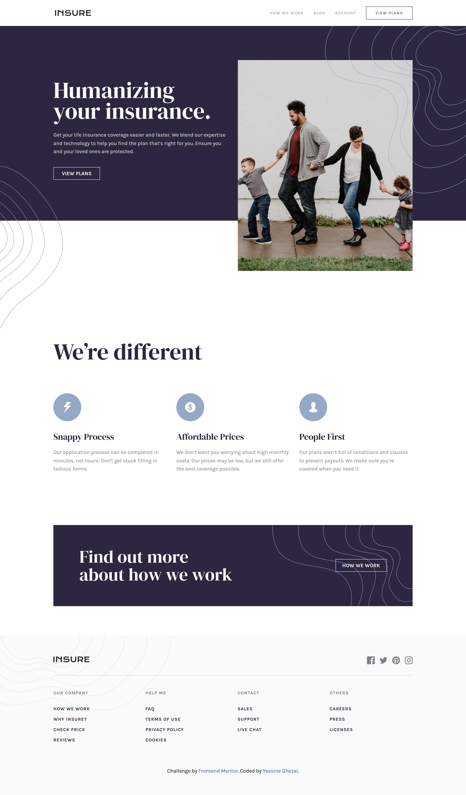
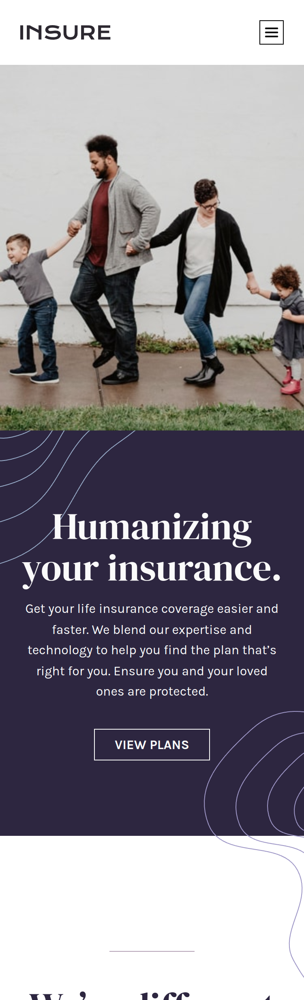

# Frontend Mentor - Insure landing page solution

This is a solution to the [Insure landing page challenge on Frontend Mentor](https://www.frontendmentor.io/challenges/insure-landing-page-uTU68JV8). Frontend Mentor challenges help you improve your coding skills by building realistic projects. 

## Table of contents

- [Overview](#overview)
  - [The challenge](#the-challenge)
  - [Screenshot](#screenshot)
  - [Links](#links)
- [My process](#my-process)
  - [Built with](#built-with)
- [Author](#author)

## Overview

### The challenge

Users should be able to:

- View the optimal layout for the site depending on their device's screen size
- See hover states for all interactive elements on the page

### Screenshot

## Desktop design

## Mobile design 

  
  
  

### Links

- Live Site URL: [Insure landing page](https://ryusuke66.github.io/insure-landing-page)

## My process

### Built with

- Semantic HTML5 markup
- CSS custom properties
- Flexbox
- CSS Grid
- Mobile-first workflow
- JavaScript

## Author

- Frontend Mentor - [@Ryusuke66](https://www.frontendmentor.io/profile/Ryusuke66)
